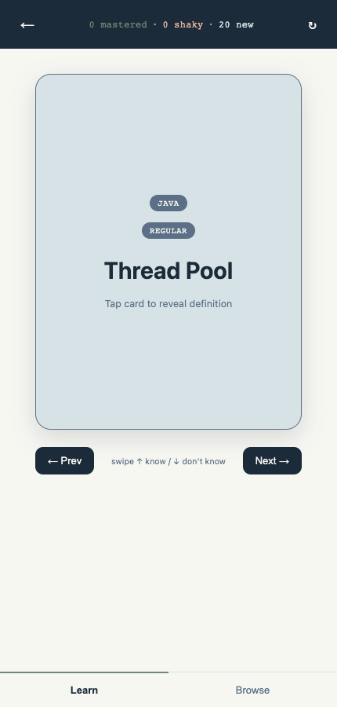
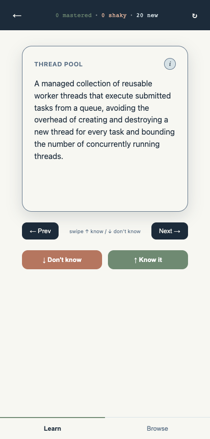
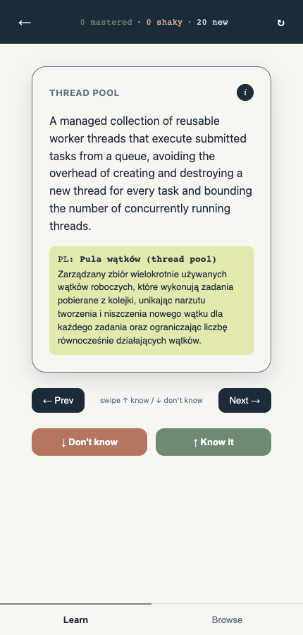
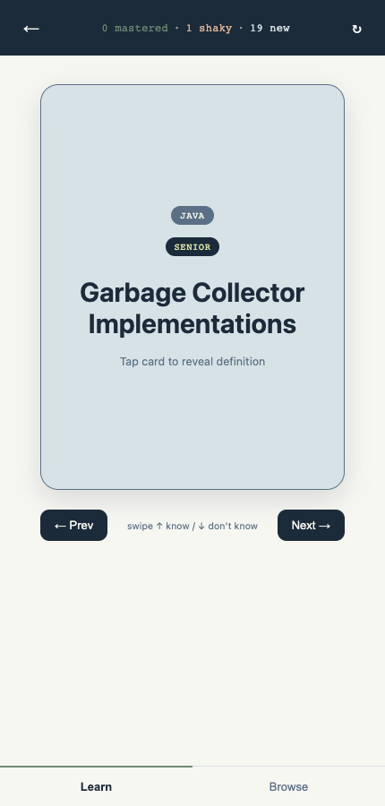
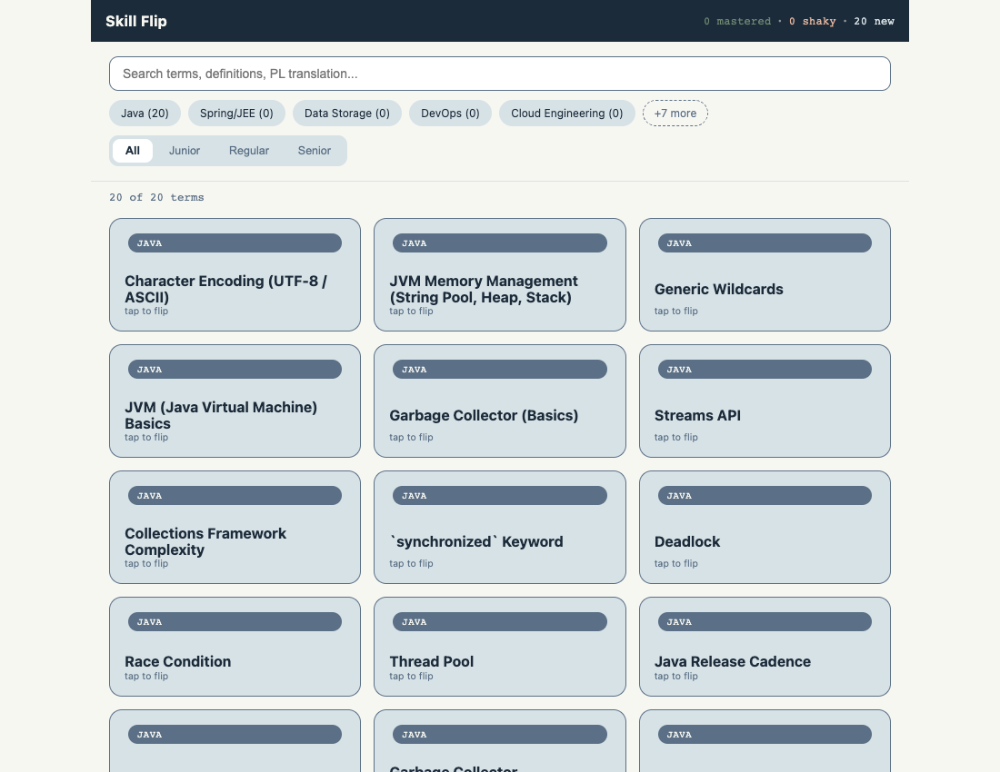
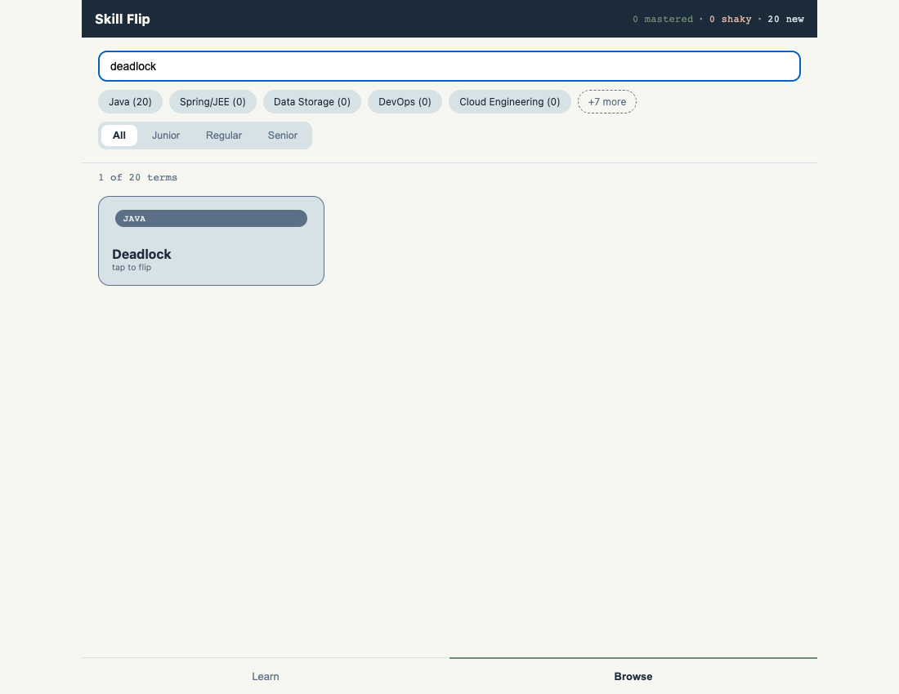
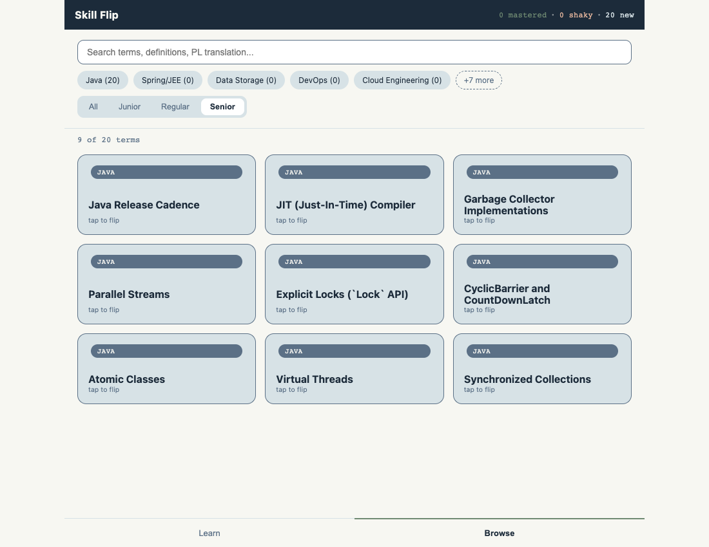
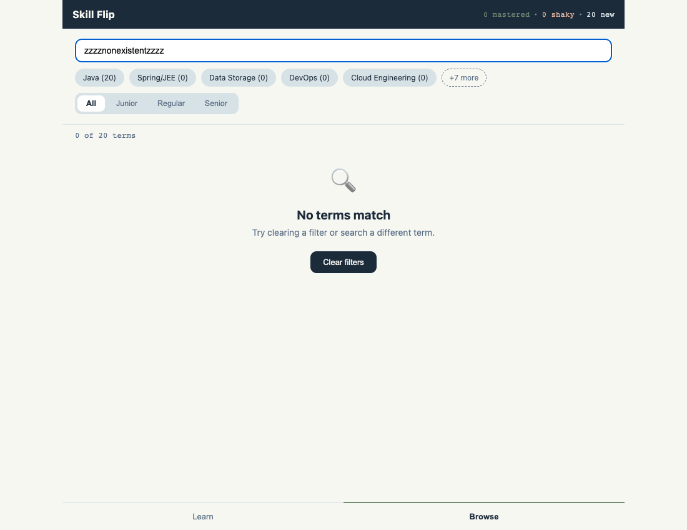

# Skill Flip — User Guide

*Last updated: 2026-07-01*

## Table of Contents

1. [What is Skill Flip?](#what-is-skill-flip)
2. [Who Should Use This?](#who-should-use-this)
3. [Getting Started](#getting-started)
4. [Learn Mode](#learn-mode)
5. [Browse Mode](#browse-mode)
6. [Switching Between Learn and Browse](#switching-between-learn-and-browse)
7. [Tips and Best Practices](#tips-and-best-practices)
8. [Troubleshooting / What If...?](#troubleshooting--what-if)

---

## What is Skill Flip?

Skill Flip is a simple flashcard app for reviewing Java and backend
engineering vocabulary — things like *Deadlock*, *Thread Pool*, or *JVM
Memory Management*. Each card has an English term and definition on one
side, with a Polish translation available on demand.

There are two ways to use it:

- **Learn Mode** — a focused, one-card-at-a-time study flow. You flip a
  card, check whether you knew the answer, and mark it. Cards you keep
  getting wrong come back around more often, so your study time naturally
  concentrates on your weak spots.
- **Browse Mode** — a searchable grid of every term, useful for scanning
  what's covered, looking something up quickly, or just exploring.

Everything runs in your browser. There's no login, no setup screen, and no
server — your progress is remembered locally on the device you're using.

---

## Who Should Use This?

- **If you're studying Java/backend engineering terms** — open the app and
  start reviewing. It picks up right where you left off; there's no "start
  a session" step.
- **If you're browsing this as a demo or portfolio piece** — head straight
  to Browse Mode to see the full set of terms, or flip a couple of cards in
  Learn Mode to get a feel for the interaction.

Currently the glossary contains a starter set of **Java-category terms**
spanning **Regular** and **Senior** difficulty levels. More categories
(Spring/JEE, Data Storage, DevOps, Cloud Engineering, and others) are shown
in the filter bar but are not populated yet — they'll show a count of `(0)`
until more terms are added.

---

## Getting Started

**What you'll need**: nothing but a web browser. No account, no install.

1. Open the app's URL. It opens directly into **Learn Mode**, showing the
   front of a card — no setup screen in the way.

   

   💡 **Tip**: The header at the top always shows your live progress —
   how many terms are `mastered`, `shaky`, or still `new`. On a brand-new
   device this starts at `0 mastered · 0 shaky · 20 new`.

**Next steps**: flip your first card (see below), or switch to Browse Mode
if you'd rather look around first.

---

## Learn Mode

Learn Mode is the main way to study. It shows you one card at a time, lets
you check the answer, and asks you to mark whether you knew it — that's
the only input it needs from you.

### How to Flip a Card

Every card starts showing just the term, its category, and its level —
no definition yet, so you can test yourself first.

**Steps**:

1. **Look at the front of the card.**

   You'll see a category badge (e.g. `JAVA`), a level badge (e.g.
   `REGULAR` or `SENIOR`), the term itself in large text, and a hint that
   says "Tap card to reveal definition."

   

   💡 **Tip**: Try to recall the definition yourself before flipping —
   that's what makes the review effective.

2. **Tap or click anywhere on the card** (or press the spacebar) to flip
   it.

   The card turns over to reveal the full English definition.

   

   ✅ **What you should see**: the term repeated in small text at the top,
   the full definition below it, and two new buttons — **Don't know** and
   **Know it** — appear underneath the card.

**Next steps**: reveal the Polish translation (optional) or mark the card
and move on — both are covered next.

---

### How to Reveal the Polish Translation

The English definition is always what you see first — the Polish
translation is only shown if you ask for it, so it doesn't give away the
answer before you've tried to recall it yourself.

**Steps**:

1. **After flipping the card**, look for the small circular **"(i)"**
   button next to the term at the top of the card's back.

2. **Tap the "(i)" button.**

   A highlighted box expands below the definition, showing both the
   Polish term and the Polish definition together.

   

   ✅ **What you should see**: a box labeled `PL:` containing the Polish
   term in bold, followed by the full Polish definition underneath it.

3. **Tap the "(i)" button again** to hide the translation if you want to
   go back to just the English side.

💡 **Tip**: Use this when a term's name doesn't ring a bell in English but
you'd recognize it in Polish, or vice versa — it's meant as a quick lookup,
not something you have to check every time.

---

### How to Mark a Card "Know It" or "Don't Know"

Once a card is flipped, marking it is what actually updates your progress.
This is the one action that decides which cards you'll see more often.

**What you'll need**: the card must be flipped first — the mark buttons
only appear on the back of the card.

**Steps**:

1. **Read the definition and decide honestly whether you knew it.**

2. **Tap "↓ Don't know"** if you didn't know it (or got it wrong), or
   **"↑ Know it"** if you got it right.

   You can also swipe down for "don't know" or swipe up for "know it" on
   a touch device, if that's more natural.

   

   ✅ **What you should see**: the app immediately moves on to the next
   card, and the progress counter at the top updates right away — for
   example, `0 mastered · 1 shaky · 19 new` after your first "Don't know"
   mark.

**How the resurfacing actually works** (in plain terms):

- Every term starts out **new**.
- Mark a term **"Don't know"** and it becomes **shaky** — shaky terms are
  shown to you noticeably more often than new or mastered ones, so you'll
  keep bumping into it until you've got it.
- Mark a shaky term **"Know it" two times in a row** and it graduates to
  **mastered**. One "know it" isn't enough on its own — this avoids
  marking something mastered off a lucky guess.
- Get a term wrong even once — including one you'd previously
  mastered — and it immediately drops back to **shaky**.
- The app never shows you the exact same card twice in a row (unless it's
  the only one left), so you always get a bit of variety.
- Once every term is mastered, cards are simply shown in a shuffled
  rotation — there's no more "weak spot" to focus on.

💡 **Tip**: There's no "session" to finish — you can review five cards
during a coffee break or fifty in one sitting, and your progress is saved
after every single mark, not just when you're done.

---

### How to Reset Your Progress

Occasionally you might want to start fresh — for example, if you want to
re-drill the whole glossary from scratch.

**Steps**:

1. **Look at the top-right of Learn Mode's header** for the reset icon
   (a circular arrow, ↻) — visible in the very first screenshot above,
   next to the progress stats.

2. **Tap the reset icon.**

3. **Confirm the browser prompt** that appears, asking you to confirm the
   reset.

   ⚠️ **Warning**: This clears every card back to "new" — mastered and
   shaky status is not recoverable once you confirm. There's no undo.

✅ **What you should see**: the progress counter returns to
`0 mastered · 0 shaky · N new` (where `N` is the total number of terms),
and the next card you're shown is drawn fresh.

---

## Browse Mode

Browse Mode shows every term at once in a grid, with search and filters —
useful when you want to scan everything that's covered, or quickly look up
one specific term instead of waiting for it to come up in Learn Mode.

### How to Search for a Term

**Steps**:

1. **Switch to Browse Mode** (see [Switching](#switching-between-learn-and-browse)
   below) if you're not already there. You'll see a search box at the top,
   category chips below it, a level filter, a running count of results,
   and the grid of terms.

   

2. **Type into the search box** — for example, `deadlock`.

   The grid updates automatically as you type (there's a brief pause
   while you're typing so it doesn't refresh on every keystroke).

   

   ✅ **What you should see**: the count above the grid updates (e.g.
   "1 of 20 terms"), and only matching cards remain visible.

💡 **Tip**: Search checks the English term, the English definition, the
Polish translation, and the Polish definition — so searching a Polish word
you remember works just as well as an English one.

### How to Filter by Category or Level

**Steps**:

1. **Tap a category chip** (e.g. "Java") to show only terms in that
   category. Tap it again to remove that filter. You can select more than
   one category chip at once.

   📝 **Note**: Chips show a live count in parentheses, like `Java (20)`.
   Categories with no terms yet show `(0)` and can still be tapped, but
   will simply show no results.

2. **Tap a level button** — **All**, **Junior**, **Regular**, or
   **Senior** — to narrow the grid to that difficulty level.

   

   ✅ **What you should see**: the result count updates immediately (e.g.
   "9 of 20 terms" when filtered to Senior-level terms), and the grid
   reflows to show only the matching cards.

Search and filters combine — for example, you can filter to "Senior" level
*and* search for a keyword at the same time.

### How to Flip a Grid Tile

Each tile in the Browse grid works the same way as the Learn Mode card,
just smaller.

**Steps**:

1. **Tap any tile** in the grid.
2. The tile flips in place to reveal its definition — no need to leave the
   grid or open a separate page.
3. **Tap it again** to flip it back.

💡 **Tip**: This is a quick way to double-check a definition while
scanning the grid, without switching to Learn Mode.

### What If My Search or Filters Return Nothing?

If a search term or filter combination doesn't match any cards, the grid
is replaced with a friendly empty state instead of just looking broken or
blank.

✅ **What you should see**: a magnifying-glass icon, a "No terms match"
heading, a short helper line, and a **"Clear filters"** button.

**Steps to recover**:

1. **Tap "Clear filters."**
2. Your search text is cleared and all category/level filters reset, and
   the full grid reappears.

---

## Switching Between Learn and Browse

A tab bar sits at the very bottom of the screen at all times, with two
tabs: **Learn** and **Browse**.

**Steps**:

1. **Tap "Browse"** (bottom-right) to jump from Learn Mode into the
   searchable grid, or **tap "Learn"** (bottom-left) to go back.

✅ **What you should see**: the view switches instantly — no page reload,
no loading spinner, and the browser's address bar doesn't change.

📝 **Note**: Switching tabs never affects your Learn Mode progress. Your
mastered/shaky/new counts, and exactly which card you were on, are exactly
as you left them when you switch back to Learn — because that progress is
saved continuously in the background, not just when you leave the screen.

💡 **Tip**: There's also an exit arrow (←) in the top-left corner of Learn
Mode's header that jumps straight to Browse — a shortcut if you're mid-way
through a card and want to look something up in the grid instead.

---

## Tips and Best Practices

- **Study little and often.** Because there's no session concept and
  progress saves instantly, five minutes here and there works just as
  well as one long sitting.
- **Be honest when marking "Know it."** The whole point of the "shaky"
  bucket is to surface things you're actually unsure about — marking
  something "Know it" you're not sure of just means you'll see it less,
  not more.
- **Use Browse Mode as a reference, not just a demo.** If a term comes up
  in Learn Mode and you want more context, you can always look it up
  directly by searching for it in Browse.
- **Your progress is per-device/per-browser.** It's stored locally, so it
  won't follow you to a different browser or device — see below.

---

## Troubleshooting / What If...?

**What if I switch devices or browsers — will my progress come with me?**
No. Progress is saved locally in your current browser, so switching
devices or clearing your browser data starts you fresh on the new one.
This is a deliberate trade-off for keeping the app simple (no accounts, no
server).

**What if I accidentally tap "Reset progress"?**
Once you confirm the reset prompt, it can't be undone — all cards return
to "new." If you back out of the confirmation prompt without confirming,
nothing is changed.

**What if the category chips show categories with no terms in them (0)?**
That's expected right now — the app currently ships with a Java-focused
starter set of terms. Other categories are visible in the filter bar
because the app is built to support them, but they'll show real counts
once more terms are added later.

**What if nothing appears when the app loads?**
If the term data fails to load, you'll see a clear error message rather
than a blank screen. Try reloading the page; if it persists, the content
file may be temporarily unavailable.

**What if I want to start over completely?**
Use the reset icon (↻) in Learn Mode's header — see
[How to Reset Your Progress](#how-to-reset-your-progress) above.
