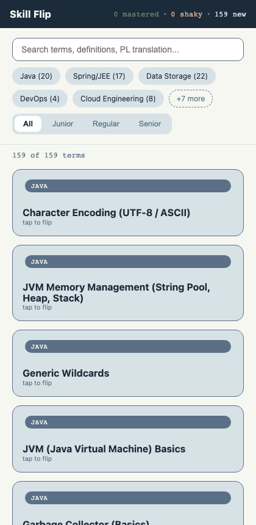
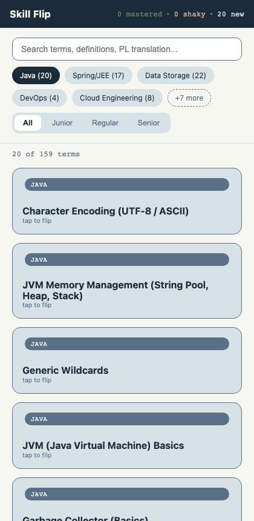
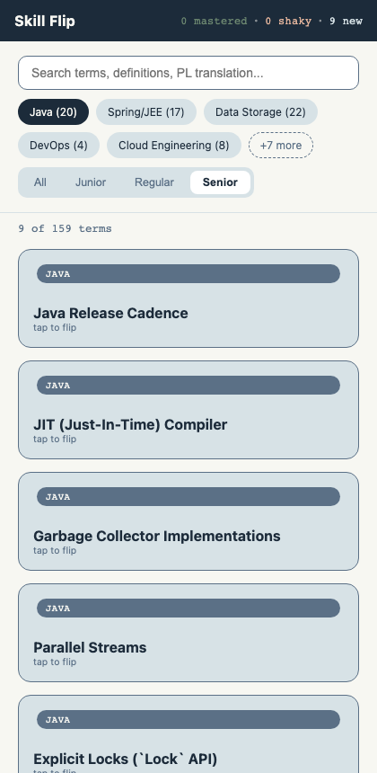
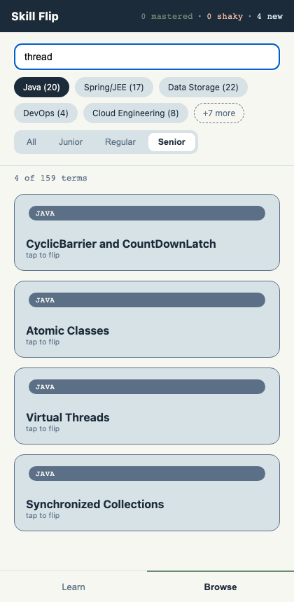
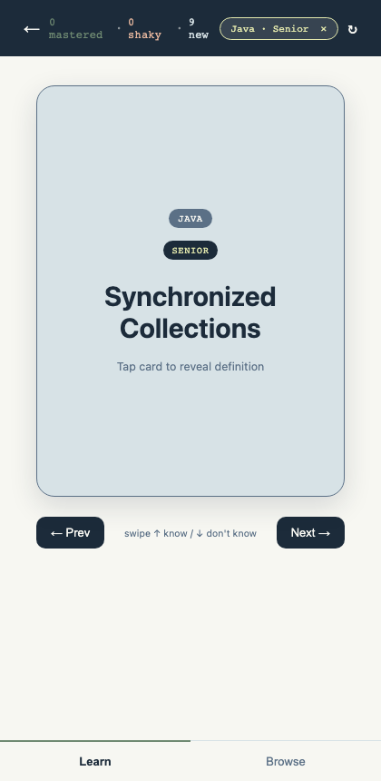
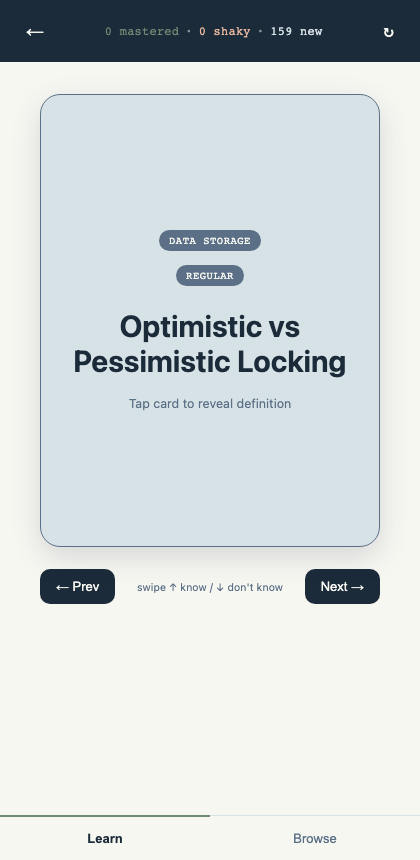
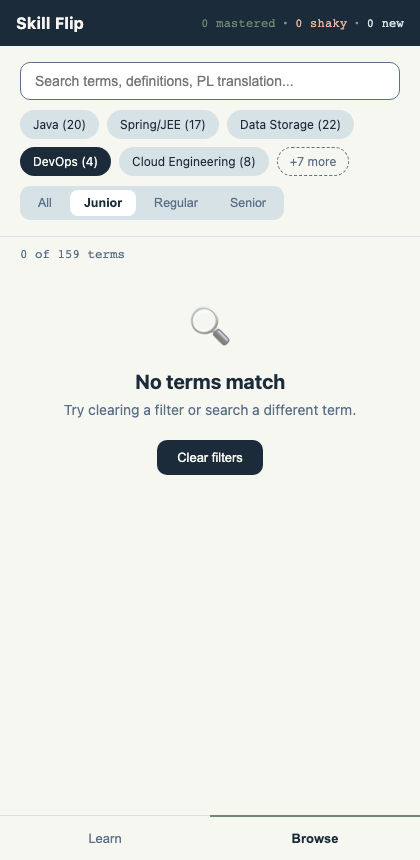
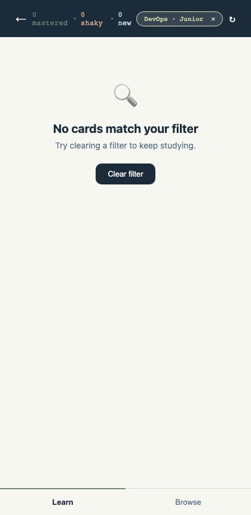
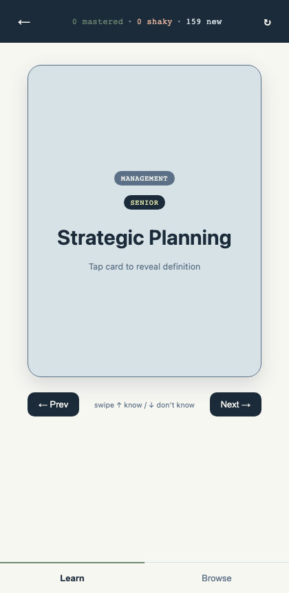

# Studying a Focused Topic in Skill Flip

*Last updated: 2026-07-05*

## What is this?

Skill Flip's **Learn Mode** now pays attention to what you're browsing. If you narrow **Browse** down to a topic — say, just Java questions at a Senior level — switching over to **Learn Mode** studies *only that topic*. No extra setup, no separate "start a session" button.

And it remembers. Close the app, come back tomorrow, and your topic filter is still there waiting for you.

## Who should use this?

Anyone using Skill Flip to study, especially if you:

- Want to drill one topic at a time (e.g. "just Spring/JEE" or "only Senior-level questions") instead of the whole 159-card deck.
- Study in short bursts and don't want to re-set your filter every time you open the app.
- Sometimes want to zoom back out and study everything again.

If you just want to flip through every card in the deck, you don't need to do anything differently — Learn Mode still works exactly the same way with no filter applied.

## Before you start

You don't need any setup or account — Skill Flip remembers your filter right in your own browser. That also means:

- 💡 The filter is remembered **on this device and browser only**. It won't follow you if you open Skill Flip on your phone after setting it on your laptop.
- 📝 Only your **category** and **level** choices are remembered. Anything you type into the search box is *not* saved — more on that below.

---

## Table of Contents

1. [Filtering Browse to a topic](#1-filtering-browse-to-a-topic)
2. [Studying just that topic in Learn Mode](#2-studying-just-that-topic-in-learn-mode)
3. [Your filter is remembered next time](#3-your-filter-is-remembered-next-time-search-text-isnt)
4. [Clearing the filter](#4-clearing-the-filter)
5. [When a filter matches no cards](#5-when-a-filter-matches-no-cards)
6. [Tips and troubleshooting](#6-tips-and-troubleshooting)

---

## 1. Filtering Browse to a Topic

Use Browse's search bar, category chips, and level buttons to narrow down the full glossary to whatever you want to focus on.

**Steps:**

1. **Open the Browse tab.**

   Tap **Browse** in the bottom navigation bar. You'll see the full list of terms — all 159 of them to start.

   

2. **Tap a category chip to narrow things down.**

   Categories like **Java**, **Spring/JEE**, or **Data Storage** appear as rounded chips near the top. Tap one to show only that category — the chip highlights, and the count above the list updates immediately.

   

   💡 **Tip**: Only the 5 most common categories show by default. Tap **"+N more"** to reveal the rest.

3. **Tap a level button to narrow further.**

   Below the category chips, tap **Junior**, **Regular**, or **Senior** to combine a level with your category choice. Tap **All** any time to remove the level restriction again.

   

   ✅ **What you should see**: The term count above the list (e.g. "9 of 159 terms") drops to match only the cards that fit both your category and level choice. You can pick more than one category chip at a time — cards from any selected category will show.

**Next step**: Switch to Learn Mode — it will already know to study just this narrowed-down set.

---

## 2. Studying Just That Topic in Learn Mode

Once you've filtered Browse to a topic, switching to Learn Mode automatically studies only those cards — you never have to tell it separately.

**Steps:**

1. **Tap Learn in the bottom navigation bar.**

   With Java + Senior still selected from the previous step, Learn Mode draws a card from *only* that 9-card subset — never from the full glossary.

   

2. **Look for the filter chip in the top bar.**

   A small pill-shaped label — something like **"Java · Senior ✕"** — appears in Learn Mode's top bar whenever a filter is active. It's your reminder of exactly what you're studying right now.

   ✅ **What you should see**: The "mastered / shaky / new" counts at the top also shrink to match — for example, "9 new" instead of "159 new" — because they're only counting the cards in your current topic.

**What if I don't filter anything?** No problem — the chip simply doesn't appear, and Learn Mode studies the entire glossary like before.

**Next step**: Just keep studying as usual — flip cards, mark them "Know it" or "Don't know". Everything works exactly like it always has, just scoped to your topic.

---

## 3. Your Filter Is Remembered Next Time (Search Text Isn't)

You don't have to re-pick your category and level every time you open Skill Flip — they're saved automatically. Your search box text, however, is treated as temporary and always starts fresh.

**Steps:**

1. **Set your filter (category + level), and optionally type something in the search box.**

   Here, Java + Senior is selected, and "thread" has been typed into the search box, narrowing things further to 4 matching terms.

   

2. **Close the tab, restart the app, or simply reload the page.**

   Your category and level choices are still there. Your search text is not — it's cleared, and the results widen back out to match just the category/level filter (9 of 159, since "thread" is no longer narrowing things down).

   

3. **Check Learn Mode too — same story.**

   The filter chip and subset-scoped stats are exactly as you left them.

   

   And Browse shows the same thing if you switch tabs:

   

📝 **Why search text isn't saved**: search is meant for a quick, one-off lookup ("did I already write a card about threads?"), not a long-term study focus. Category and level are the two things you're likely to want to keep coming back to, so those are the only two that get remembered.

⚠️ **Note**: this is remembered in your browser only. Clearing your browser's site data, using a private/incognito window, or switching devices will reset it back to no filter.

---

## 4. Clearing the Filter

You can drop back to studying (or browsing) everything at any time, from either screen — and both screens always agree on the result.

**Option A — From Learn Mode's filter chip**

1. **Tap the ✕ on the filter chip** in Learn Mode's top bar.

   

2. **Check Browse** — it updates too, immediately, without needing a reload.

   

**Option B — From Browse's own "Clear filters" button**

This button appears automatically whenever your current filter matches zero cards (see the next section) — it's the same "start over" action either way.

✅ **What you should see either way**: no category chip or level button stays highlighted, the full 159-term/159-card count returns everywhere, and the filter chip disappears from Learn Mode. Whichever screen you clear it from, the other screen catches up instantly — you never need to switch tabs or reload to see it take effect.

---

## 5. When a Filter Matches No Cards

Some category + level combinations simply don't have any matching cards yet (for example, this app doesn't currently have any Junior-level DevOps cards). Instead of showing a confusing blank screen, both Browse and Learn Mode show a friendly message telling you what happened and how to fix it.

**In Browse:**

**In Learn Mode:**

If you switch to Learn Mode while a zero-match filter is active, you'll see the same friendly treatment instead of a card:

**Steps to recover:**

1. **Tap "Clear filter" (or "Clear filters" in Browse).**

   This immediately drops the filter and brings back your full deck.

   

✅ **What you should see**: a normal card appears again, the stats read "159 new" (or wherever your progress currently stands), and the filter chip is gone.

**What if…?**

- **…I only pick a level (no category) and it's still empty?** That shouldn't happen — every level has at least some cards across all categories. A zero-match result means the *combination* of your chosen category and level has nothing yet.
- **…I want to see just the empty topic without clearing it?** That's exactly what this screen is for — it tells you plainly that nothing matches, rather than silently falling back to a bigger pool of cards you didn't ask for.

---

## 6. Tips and Troubleshooting

- 💡 **Combine categories.** You can select more than one category chip at once (e.g. Java *and* Spring/JEE) to study a broader mix without going all the way back to "All".
- 💡 **The filter chip is clickable from anywhere in Learn Mode.** You don't need to flip through cards first — the ✕ is always available in the top bar the moment a filter is active.
- ⚠️ **Marking cards "Know it" / "Don't know" still works the same as always**, even with a filter active — your progress is saved per card, not per filter, so a card you've mastered stays mastered even if you later filter it out and back in.
- ⚠️ **"Reset progress" resets everything, not just your current topic.** If you tap the reset icon (↻) in Learn Mode, it clears mastered/shaky status for the *entire* glossary, not just the cards you're currently filtered to.
- 📝 **Search box behavior is intentional, not a bug.** If you ever wonder "why did my search text disappear but not my category?" — see [Section 3](#3-your-filter-is-remembered-next-time-search-text-isnt) above. It's designed that way.

---

## Related Features

- **Browse**: search, category chips, and level filtering — the starting point for narrowing down what Learn Mode studies.
- **Learn Mode progress tracking**: the "mastered / shaky / new" stats and the "Reset progress" button, both of which now automatically scope to whatever topic you're currently filtered to.
