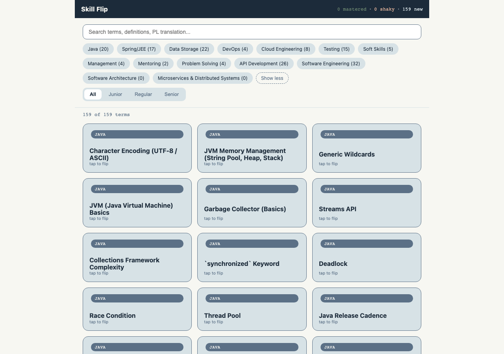
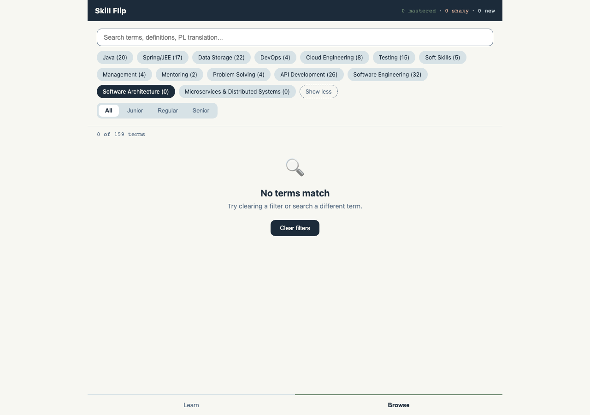
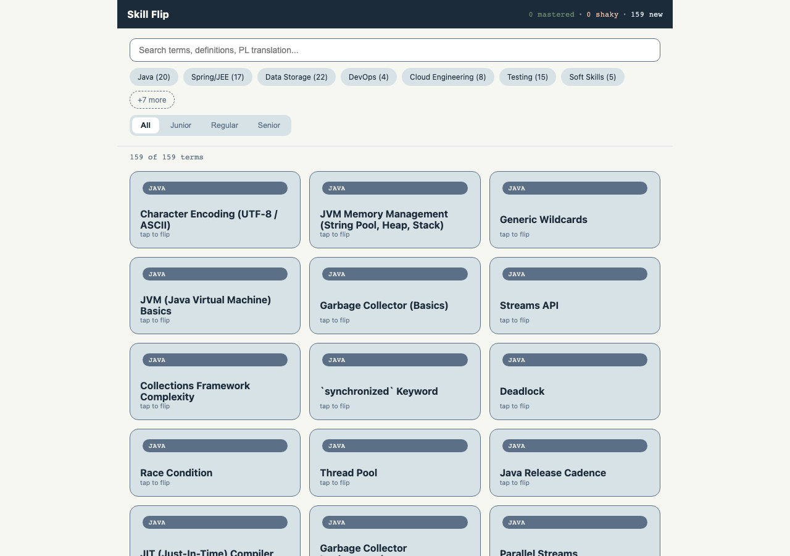

# What's New in Skill Flip: More Categories & Easier Browsing

*Last updated: 2026-07-14*

## What is this update?

Skill Flip just got two updates that make it easier to explore your flashcard collection:

1. **Two new topic categories** have been added to the lexicon: **Software Architecture** and **Microservices & Distributed Systems**.
2. **Browsing by category is easier.** The list of category buttons (called "chips") in the Browse tab can now be expanded to see everything, and — this is the fix — collapsed back down again whenever you want.

Neither change requires you to do anything. Just open the app and the new categories and improved browsing are already there.

## Who is this for?

This guide is for anyone using Skill Flip to study Java/Backend engineering terms — whether you're reviewing flashcards for yourself or just exploring the app. No technical background needed.

---

## What's New: Two New Categories

Skill Flip organizes its flashcards into topic categories, like "Java," "Testing," or "DevOps." There are now **14 categories** instead of 12. The two newest are:

- **Software Architecture**
- **Microservices & Distributed Systems**

📝 **Note**: These two categories are brand new and don't have any flashcards in them yet — you'll see a **(0)** next to their names. Study content for these topics is on its way in a future update. In the meantime, they show up as empty categories so you know they're coming.

---

## Basic Tasks

### How to Browse Categories

The Browse tab shows a row of category buttons ("chips") above your flashcards. Each one tells you the category name and how many terms are inside, like `Java (20)`.

**What you'll need**: Nothing — just open Skill Flip and tap the **Browse** tab at the bottom of the screen.

**Steps**:

1. **Open Browse**

   When you open Browse, you'll see the 7 most common categories right away, plus a **"+7 more"** button that hints there are more to explore.

   

   💡 **Tip**: The number in parentheses (like `Java (20)`) tells you how many flashcards are in that category — handy for knowing where to focus your studying.

2. **See all categories**

   Tap **"+7 more"** to reveal the rest of the categories, including the two brand-new ones.

   

   ✅ **What you should see**: All 14 categories laid out, and the button that used to say "+7 more" now says **"Show less."**

3. **Collapse the list back down**

   Once you're done browsing the full list, tap **"Show less"** to tidy the screen back up. This is the fix in this update — until now, once you expanded the list it stayed expanded and cluttered the screen. Now it collapses just as easily as it expands.

   ✅ **What you should see**: The category row goes right back to showing only 7 chips plus "+7 more," exactly like when you first opened Browse.

**Next steps**: Try tapping a category chip to filter your flashcards down to just that topic.

---

### How to Filter Flashcards by Category

Tapping a category chip filters the flashcard grid to show only terms from that category — great for focused study sessions.

**Steps**:

1. **Tap a category chip**

   For example, expand the list and tap **"Software Architecture (0)."** The chip turns dark to show it's selected.

   

   ✅ **What you should see**: The chip you tapped is highlighted, and the flashcard grid updates to match. Since Software Architecture doesn't have any terms yet, you'll see a friendly "No terms match" message — this is expected, not an error (see the note about new categories above).

   💡 **Tip**: You can select more than one category at a time — tap a second chip to combine categories, or tap a selected chip again to deselect it.

2. **Your selection stays active, even if you collapse the list**

   Here's the useful part: if you select a category while the list is expanded and then tap "Show less," your selected category keeps filtering your flashcards — it just isn't shown as a visible chip anymore because it's tucked into the collapsed "+7 more" group. Your filtered results don't change; only the chip row gets tidier.

   💡 **Tip**: If your flashcard count looks unexpectedly low after collapsing the category list, tap "+7 more" again to check whether a category chip further down is still selected.

**Next steps**: Combine a category filter with the search box or the Junior/Regular/Senior level tabs above the flashcards to narrow things down even further.

---

### How to Clear Your Filters

If you've filtered down to a specific category (or several) and want to get back to browsing everything, use "Clear filters."

**Steps**:

1. **Tap "Clear filters"**

   You'll see this button whenever your current filters don't match any flashcards, right underneath the "No terms match" message.

2. **Everything resets at once**

   Clearing filters does three things together: it removes any selected categories, clears the search box, and — as of this update — also collapses an expanded category list back down to the default 7 chips.

   

   ✅ **What you should see**: All 159 terms are back, the category row is back to its short, tidy default, and the search box is empty.

---

## Tips and Best Practices

- 💡 The number next to each category (like `Testing (15)`) is always live — it reflects exactly how many flashcards you'll see if you select that chip.
- 💡 Category chips work independently of the Junior/Regular/Senior level tabs and the search box — you can combine all three to zero in on exactly the flashcards you want to review.
- 💡 The expand/collapse state of the category list is just a display preference — it always starts collapsed when you reload the page, so you'll never get stuck with a permanently long list.

## What If...?

**What if I select "Software Architecture" or "Microservices & Distributed Systems" and see no flashcards?**

That's expected right now. Both categories were just added to make room for upcoming content — think of them as placeholders. Tap "Clear filters" to go back to browsing everything, and check back after a future content update for terms in these two categories.

**What if the category list won't stay expanded?**

It's not supposed to — by design, the expanded view is temporary. It collapses back to the compact 7-chip view whenever you tap "Show less" or "Clear filters," and it always starts collapsed the next time you open the app. This keeps the screen tidy, especially on smaller devices.

**What if I can't remember which categories I selected after collapsing the list?**

Look at the "X of 159 terms" counter above the flashcard grid — if it's lower than 159, a filter is still active somewhere. Tap "+7 more" to see the full category list and check which chips are still highlighted, or just tap "Clear filters" to start fresh.

---

## Related Features

- **Learn Mode**: Skill Flip's other main tab, for spaced-repetition style flashcard review. Learn Mode respects whatever category filter you last set in Browse, so a focused category selection carries over between the two modes.

---

*This guide covers the Browse tab's category filtering and the new Software Architecture / Microservices & Distributed Systems categories. Flashcard content for the two new categories will be added in a future update.*
